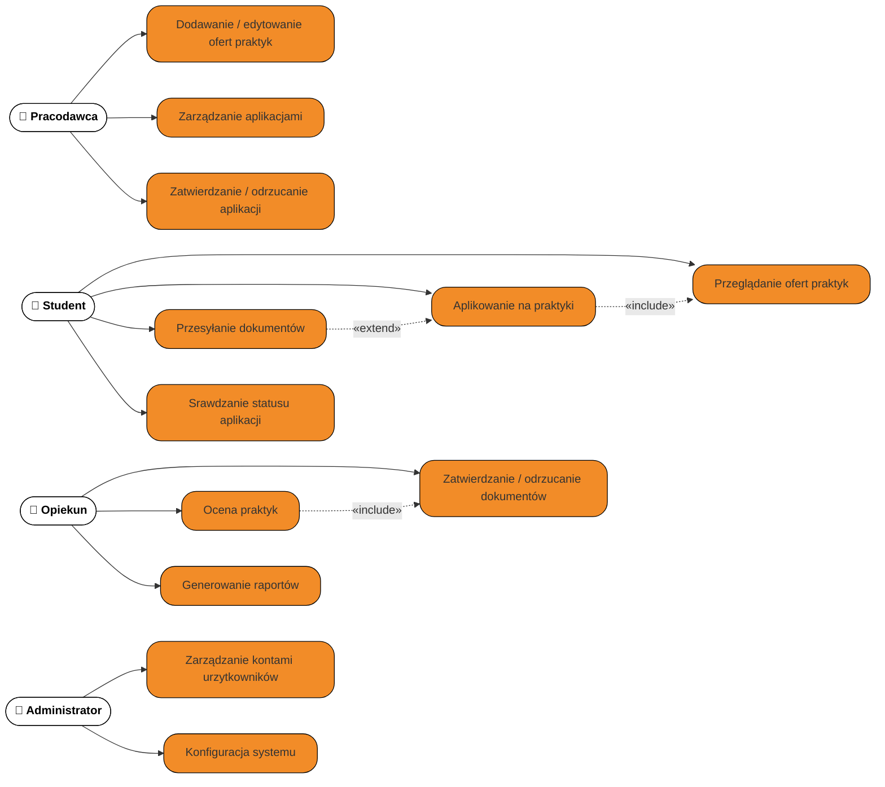
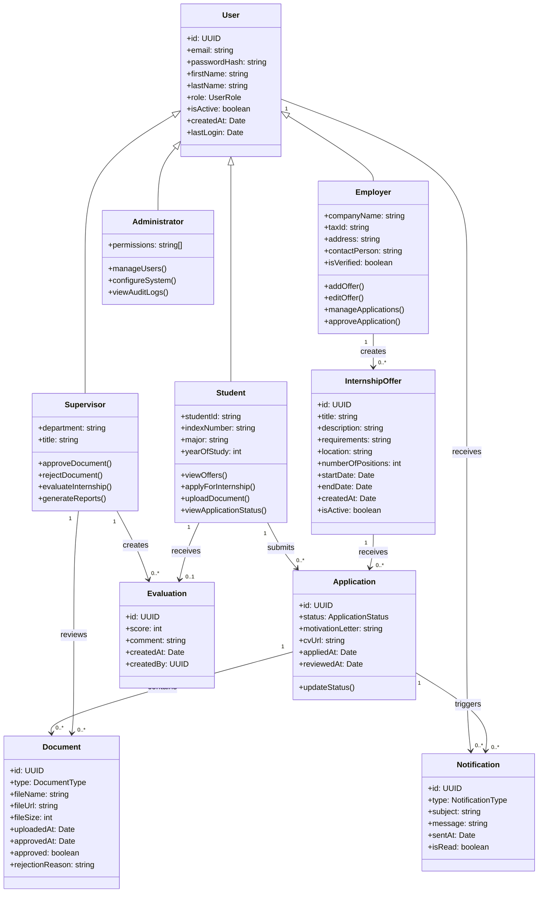

# 📄 Specyfikacja wymagań – Aplikacja do zarządzania praktykami studenckimi

## 1. Wprowadzenie

### 1.1 Cel dokumentu

Celem dokumentu jest przedstawienie wymagań funkcjonalnych i niefunkcjonalnych systemu wspierającego zarządzanie praktykami studenckimi. Specyfikacja zostanie wykorzystana podczas projektowania, implementacji oraz testowania systemu.

### 1.2 Zakres systemu

System umożliwia obsługę całego procesu praktyk: od publikacji ofert, poprzez aplikowanie studentów i zatwierdzanie dokumentów, aż po ocenę końcową.

## 2. Identyfikacja interesariuszy

| Interesariusz                | Opis roli                             | Potrzeby                                                                            |
| ---------------------------- | ------------------------------------- | ----------------------------------------------------------------------------------- |
| Student                      | osoba odbywająca praktyki             | dostęp do ofert, możliwość aplikacji, monitorowanie statusu, przesyłanie dokumentów |
| Opiekun praktyk / Wykładowca | osoba zatwierdzająca przebieg praktyk | przegląd dokumentów, ocena praktyk, komunikacja ze studentem                        |
| Pracodawca / Firma           | organizacja oferująca praktyki        | publikacja ofert, przegląd aplikacji, potwierdzanie odbycia praktyki                |
| Administrator                | zarządza platformą                    | moderacja użytkowników, konfiguracja, raporty                                       |
| Dział IT                     | utrzymanie techniczne                 | stabilność, bezpieczeństwo, backup                                                  |
| Uczelnia / Władze            | nadzorują procesy                     | raporty, statystyki, zgodność z procedurami                                         |

## 3. Wymagania funkcjonalne

### 3.1 Lista wymagań (tabelarycznie)

**Wymagania funkcjonalne (F)**

| ID  | Opis wymagania                                             | Priorytet | Źródło        |
| --- | ---------------------------------------------------------- | --------- | ------------- |
| F1  | Student może przeglądać dostępne oferty praktyk            | Must      | Student       |
| F2  | Student może aplikować na wybraną ofertę                   | Must      | Student       |
| F3  | Student może przesyłać dokumenty (umowa, dziennik praktyk) | Must      | Student       |
| F4  | Student może śledzić status swojej aplikacji               | Must      | Student       |
| F5  | Pracodawca może dodawać i edytować oferty praktyk          | Must      | Firma         |
| F6  | Pracodawca może przeglądać aplikacje studentów             | Must      | Firma         |
| F7  | Pracodawca może zatwierdzać lub odrzucać aplikacje         | Must      | Firma         |
| F8  | Opiekun może zatwierdzać lub odrzucać dokumentację praktyk | Must      | Opiekun       |
| F9  | Opiekun może oceniać praktykę                              | Should    | Opiekun       |
| F10 | Administrator może zarządzać kontami użytkowników          | Must      | Administrator |
| F11 | Administrator może konfigurować parametry systemu          | Should    | Administrator |
| F12 | System wysyła powiadomienia e-mail o statusie praktyki     | Should    | Student       |
| F13 | System generuje raporty o przebiegu praktyk                | Could     | Uczelnia      |
| F14 | System umożliwia eksport danych do PDF/CSV                 | Could     | Uczelnia      |
| F15 | System umożliwia wideorozmowy z pracodawcą                 | Won't     | Student       |
| F16 | Integracja z LinkedIn do importu CV                        | Won't     | Student       |

### 3.2 User Stories (perspektywa użytkownika)

- Jako student chcę przeglądać dostępne praktyki, aby znaleźć ofertę dopasowaną do moich potrzeb.
- Jako student chcę śledzić status mojej aplikacji, aby wiedzieć, co jeszcze muszę zrobić.
- Jako student chcę otrzymywać powiadomienia e-mail, aby być na bieżąco z procesem praktyk.
- Jako pracodawca chcę publikować oferty, aby studenci mogli na nie aplikować.
- Jako pracodawca chcę przeglądać profile aplikujących studentów, aby wybrać najlepszych kandydatów.
- Jako opiekun chcę zatwierdzać dokumentację, aby proces praktyk był zgodny z regulaminem uczelni.
- Jako opiekun chcę generować raporty, aby monitorować postępy studentów.
- Jako administrator chcę zarządzać kontami, aby zapewnić bezpieczeństwo systemu.

### 3.3 Diagram przypadków użycia (Use Case Diagram)

### 3.4 Przypadki użycia (Use Case Specification)

#### Use Case 1: Przeglądanie ofert praktyk (UC1)

**Aktor:** Student

**Warunek wstępny:** Student jest zalogowany w systemie.

**Scenariusz główny:**

1. Student wchodzi na stronę z ofertami praktyk.
2. System wyświetla listę aktywnych ofert.
3. Student może filtrować oferty (lokalizacja, branża, termin).
4. Student wybiera interesującą ofertę.
5. System wyświetla pełny opis oferty.

**Scenariusz alternatywny:**

- Brak dostępnych ofert → system informuje o braku aktywnych ofert i sugeruje założenie alertu.
- Filtry nie zwracają wyników → system informuje o braku ofert spełniających kryteria.

---

#### Use Case 2: Aplikowanie na praktykę (UC2)

**Aktor:** Student

**Warunek wstępny:** Student jest zalogowany i przeglądał oferty (UC1).

**Scenariusz główny:**

1. Student wybiera ofertę praktyk.
2. System wyświetla szczegóły oferty.
3. Student klika „Aplikuj".
4. System sprawdza, czy student nie przekroczył limitu aplikacji (max 5).
5. System wyświetla formularz aplikacji (motywacja, CV).
6. Student wypełnia formularz i zatwierdza.
7. System zapisuje aplikację i wysyła powiadomienie pracodawcy.
8. System wyświetla potwierdzenie i zmienia status na "Oczekuje na rozpatrzenie".

**Scenariusz alternatywny:**

- Student przekroczył limit aplikacji → system odmawia i informuje o limicie.
- Firma zamknęła rekrutację → system informuje, że aplikacja jest niemożliwa.
- Brak wymaganych pól w formularzu → system wyświetla błędy walidacji.

---

#### Use Case 3: Przesyłanie dokumentów (UC3)

**Aktor:** Student

**Warunek wstępny:** Student ma zatwierdzoną aplikację przez pracodawcę.

**Scenariusz główny:**

1. Student wchodzi w szczegóły swojej aplikacji.
2. System wyświetla listę wymaganych dokumentów (umowa, dziennik praktyk).
3. Student wybiera "Prześlij dokument".
4. System otwiera okno uploadu.
5. Student wybiera plik (PDF, DOCX, max 10MB).
6. System waliduje format i rozmiar pliku.
7. System zapisuje dokument i powiadamia opiekuna.

**Scenariusz alternatywny:**

- Plik ma niewłaściwy format → system odrzuca i informuje o dozwolonych formatach.
- Plik przekracza 10MB → system informuje o limicie rozmiaru.
- Błąd połączenia podczas uploadu → system umożliwia ponowną próbę.

---

#### Use Case 4: Publikowanie oferty praktyk (UC5)

**Aktor:** Pracodawca

**Warunek wstępny:** Pracodawca jest zalogowany i zweryfikowany przez administratora.

**Scenariusz główny:**

1. Pracodawca klika "Dodaj ofertę".
2. System wyświetla formularz z polami: tytuł, opis, lokalizacja, wymagania, liczba miejsc, termin.
3. Pracodawca wypełnia formularz.
4. System waliduje dane (wszystkie wymagane pola wypełnione).
5. System zapisuje ofertę jako aktywną.
6. System powiadamia administratora o nowej ofercie (opcjonalnie).
7. System wyświetla potwierdzenie publikacji.

**Scenariusz alternatywny:**

- Brak wymaganych pól → system wyświetla błędy walidacji.
- Firma ma zablokowane konto → system odmawia publikacji i wyświetla komunikat.
- Oferta zawiera niedozwolone treści → system flaguje do moderacji.

---

#### Use Case 5: Zatwierdzenie dokumentów (UC8)

**Aktor:** Opiekun praktyk

**Warunek wstępny:** Student przesłał dokumenty do systemu.

**Scenariusz główny:**

1. Opiekun otwiera listę studentów wymagających weryfikacji.
2. System wyświetla statusy dokumentów (oczekujące, zatwierdzone, odrzucone).
3. Opiekun wybiera studenta z listy.
4. System wyświetla przesłane dokumenty do podglądu.
5. Opiekun przegląda dokumenty.
6. Opiekun zatwierdza lub odrzuca dokumentację z opcjonalnym komentarzem.
7. System aktualizuje status i informuje studenta e-mailem o decyzji.

**Scenariusz alternatywny:**

- Dokument jest nieczytelny → opiekun odrzuca z prośbą o ponowne przesłanie.
- Brak wszystkich wymaganych dokumentów → opiekun częściowo zatwierdza i prosi o uzupełnienie.

---

#### Use Case 6: Ocena praktyki (UC9)

**Aktor:** Opiekun praktyk

**Warunek wstępny:** Dokumentacja studenta została zatwierdzona (UC8).

**Scenariusz główny:**

1. Opiekun wybiera studenta z listy zakończonych praktyk.
2. System wyświetla formularz oceny (skala 2-5, komentarz).
3. Opiekun wypełnia ocenę i komentarz.
4. System zapisuje ocenę.
5. System powiadamia studenta o wystawionej ocenie.
6. System archiwizuje praktykę jako zakończoną.

**Scenariusz alternatywny:**

- Opiekun próbuje ocenić przed zatwierdzeniem dokumentów → system blokuje i informuje o wymaganej kolejności.

---

#### Use Case 7: Zarządzanie kontami użytkowników (UC11)

**Aktor:** Administrator

**Warunek wstępny:** Administrator jest zalogowany z uprawnieniami administratora.

**Scenariusz główny:**

1. Administrator wchodzi do panelu zarządzania użytkownikami.
2. System wyświetla listę wszystkich użytkowników.
3. Administrator może wyszukiwać, filtrować (po roli, statusie).
4. Administrator wybiera użytkownika.
5. System wyświetla szczegóły konta.
6. Administrator może: aktywować, dezaktywować, zmienić rolę, zresetować hasło.
7. System zapisuje zmiany i loguje akcję.

**Scenariusz alternatywny:**

- Próba usunięcia konta z aktywnymi praktykami → system ostrzega i wymaga potwierdzenia.
- Zmiana roli wymaga dodatkowej autoryzacji → system żąda potwierdzenia hasłem administratora.

## 4. Wymagania niefunkcjonalne

### 4.1 Bezpieczeństwo

- **NF1:** System musi korzystać z protokołu HTTPS (SSL/TLS) dla wszystkich połączeń.
- **NF2:** Dostęp do funkcji musi być zależny od roli użytkownika (RBAC - Role-Based Access Control).
- **NF3:** Dane osobowe muszą być przetwarzane zgodnie z RODO (przechowywanie max 5 lat po zakończeniu studiów).
- **NF4:** Przechowywane dokumenty muszą być zabezpieczone przed nieuprawnionym dostępem (szyfrowanie AES-256).
- **NF5:** System musi logować wszystkie operacje krytyczne (logowanie, zmiana uprawnień, usuwanie danych).
- **NF6:** Hasła użytkowników muszą być hashowane algorytmem bcrypt lub Argon2.
- **NF7:** System wymusza silne hasła (min. 8 znaków, wielkie i małe litery, cyfry, znaki specjalne).

### 4.2 Wydajność

- **NF8:** System musi obsługiwać minimum 1000 jednoczesnych użytkowników przy maksymalnej degradacji wydajności o 10%.
- **NF9:** Czas ładowania strony głównej < 1,5 sekundy.
- **NF10:** Czas wyszukiwania ofert < 2 sekundy.
- **NF11:** Czas uploadu dokumentu (do 5MB) < 5 sekund przy standardowym łączu internetowym (10 Mbps).
- **NF12:** Czas generowania raportu PDF < 10 sekund (dla zestawienia do 100 rekordów).

### 4.3 Dostępność

- **NF13:** System dostępny 24/7 przez cały rok akademicki.
- **NF14:** Planowany poziom SLA: 99,5% (maksymalnie 3,6 godziny przestoju miesięcznie).
- **NF15:** Kopie zapasowe **pełne** co 24h, **inkrementalne** co 6h.
- **NF16:** Czas odtworzenia z backupu (RTO) < 4 godziny.
- **NF17:** Maksymalna utrata danych (RPO) < 6 godzin.
- **NF18:** System posiada redundancję serwerów (hot standby) z automatycznym przełączaniem.

### 4.4 Użyteczność

- **NF19:** Interfejs użytkownika zgodny z WCAG 2.1 poziom AA (dostępność dla osób z niepełnosprawnościami).
- **NF20:** System musi działać poprawnie na komputerach i urządzeniach mobilnych (Responsive Web Design).
- **NF21:** Interfejs dostępny w języku polskim i angielskim.
- **NF22:** System musi być kompatybilny z przeglądarkami: Chrome, Firefox, Safari, Edge (ostatnie 2 wersje).
- **NF23:** System zapewnia kontekstową pomoc i tooltips dla skomplikowanych funkcji.
- **NF24:** Wszystkie formularze mają walidację po stronie klienta i serwera z czytelnymi komunikatami błędów.

### 4.5 Integracja

- **NF25:** System umożliwia eksport raportów do formatów PDF i CSV.
- **NF26:** System udostępnia REST API do integracji z systemem dziekanatowym.
- **NF27:** System wspiera wysyłkę powiadomień e-mail poprzez SMTP.
- **NF28:** System może być zintegrowany z systemem SSO uczelni (Single Sign-On).

### 4.6 Skalowalność i utrzymanie

- **NF29:** Architektura systemu musi umożliwiać skalowanie horyzontalne (dodawanie serwerów).
- **NF30:** Kod źródłowy musi być dokumentowany i zgodny z przyjętymi standardami kodowania.
- **NF31:** System musi posiadać środowiska: deweloperskie, testowe, produkcyjne.
- **NF32:** Wdrożenia nowych wersji muszą być możliwe bez przestoju systemu (zero-downtime deployment).

## 5. Ograniczenia i założenia

### 5.1 Ograniczenia techniczne

- System nie obsługuje płatności online (praktyki są bezpłatne).
- Maksymalny rozmiar pojedynczego dokumentu: 10 MB.
- Obsługiwane formaty dokumentów: PDF, DOCX, JPG, PNG.
- System nie zapewnia wbudowanej komunikacji wideo (poza zakresem pierwszej wersji).

### 5.2 Założenia biznesowe

- Każdy student może aplikować maksymalnie na 5 ofert jednocześnie.
- Oferta praktyk jest aktywna przez 60 dni lub do zapełnienia miejsc.
- Dokumenty muszą być zatwierdzone przez opiekuna w ciągu 14 dni od przesłania.
- Student musi ukończyć co najmniej 2 rok studiów, aby móc aplikować na praktyki.
- Pracodawca musi być zweryfikowany przez administratora przed publikacją pierwszej oferty.

### 5.3 Założenia dotyczące użytkowników

- Użytkownicy posiadają podstawową znajomość obsługi przeglądarek internetowych.
- Użytkownicy mają dostęp do działającego adresu e-mail (komunikacja systemowa).
- Studenci mają dostęp do dokumentów wymaganych przez uczelnię (umowa, dziennik praktyk).

## 6. Diagram klas (Class Diagram)

## 7. Podsumowanie

Niniejsza specyfikacja zawiera:

✅ Kompletną identyfikację 6 grup interesariuszy z opisem potrzeb.  
✅ 16 wymagań funkcjonalnych (F1-F16) z priorytetyzacją metodą MoSCoW.  
✅ 8 user stories opisujących potrzeby użytkowników.  
✅ Diagram przypadków użycia (Use Case Diagram) dla 4 głównych aktorów i 12 przypadków użycia.  
✅ Szczegółowe specyfikacje 7 najważniejszych przypadków użycia z scenariuszami głównymi i alternatywnymi.  
✅ 32 wymagania niefunkcjonalne (NF1-NF32) w 6 kategoriach: bezpieczeństwo, wydajność, dostępność, użyteczność, integracja, skalowalność.  
✅ Sekcję ograniczeń i założeń projektowych.  
✅ Diagram klas przedstawiający strukturę logiczną systemu.

Niniejsze opracowanie tworzy trwały fundament pod przyszłe prace nad architekturą, realizację techniczną oraz przygotowanie scenariuszy testowych. Dokumentacja ta pokrywa obszary funkcjonalne i niefunkcjonalne, oferując kompleksowy obraz założeń dla platformy obsługi praktyk studenckich.
